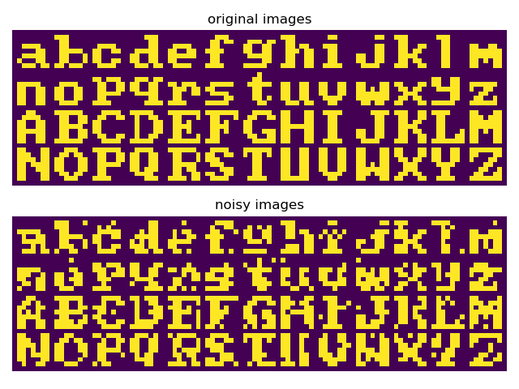

# PyTorch custom dataloader

## PyTorch custom dataloader for efficient data manipulation

### Table of Contents

- [Images](#images)
- [Description](#description)
- [Keywords](#keywords)
- [How to Use](#how-to-use)
- [References](#references)
- [Author Info](#author-info)

## Images

## Description

"PyTorch custom dataloader for efficient data manipulation."

#### Technologies

- Python programming language

## Keywords

 - PyTorch
 - Custom Datasets
 - DataLoaders
 - Transforms

## How to Use

#### Getting started

`git clone https://github.com/berberianareg/PyTorch-custom-dataloader.git`

#### Dependencies

see requirements.txt

#### Executing the program from command line

`./run_Visualize_dataset.sh`

#### API Reference

## References

#### Links

- Relevant webpage - (https://pytorch.org/tutorials/beginner/data_loading_tutorial.html)

## Author Info

- Twitter - [@berberianareg](https://twitter.com/BerberianNareg)
- LinkedIn - [Nareg Berberian](https://www.linkedin.com/in/nareg-berberian-phd-ab6759b9/)

[Back to the Top](#pytorch-custom-dataloader)